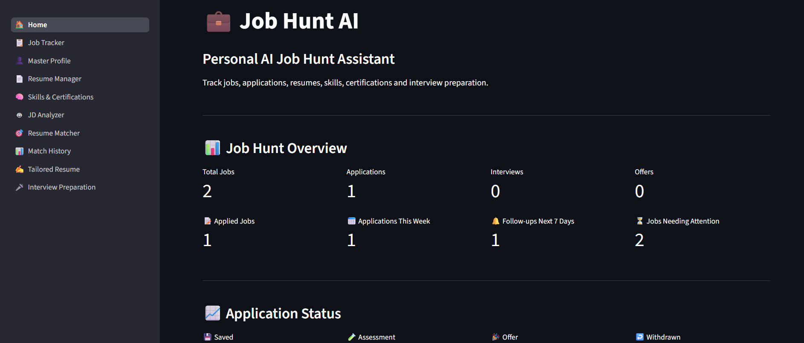
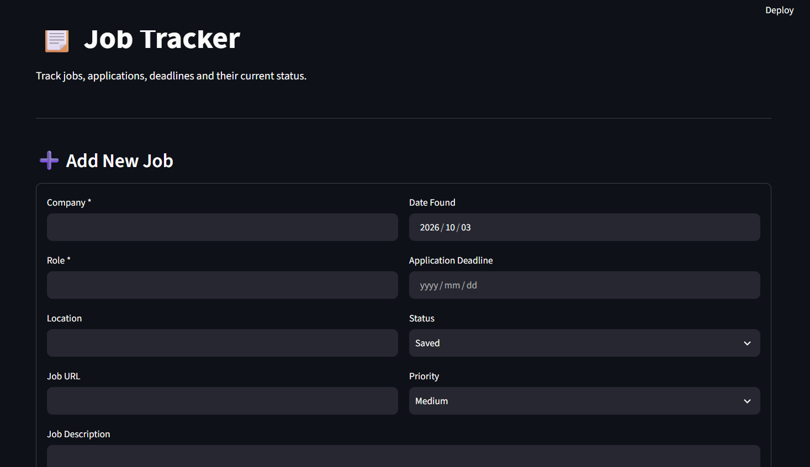
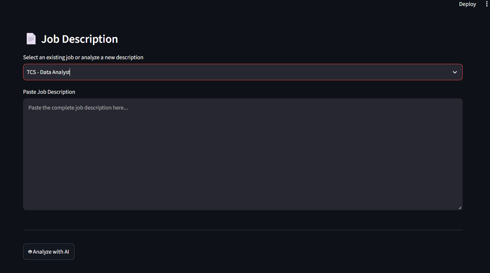

# 💼 JobHuntAI

### AI-Powered Job Search & Application Assistant

JobHuntAI is a personal AI-powered job management platform built with **Python, Streamlit, SQLite and Google Gemini API**.

It helps job seekers manage their job search from discovering and tracking opportunities to analyzing job descriptions, matching resumes, generating tailored resumes and preparing for interviews.

---

## 🚀 Features

### 📋 Job & Application Tracker
- Add and manage job opportunities
- Track company, role, location and job URL
- Track application status
- Set job priority
- Store application deadlines
- Record application dates
- Track resume used for each application
- Schedule follow-up dates
- Add application notes

### 👤 Master Profile
Maintain a centralized professional profile containing:
- Name
- Email
- Phone
- Location
- LinkedIn
- GitHub
- Portfolio
- Professional summary
- Skills

### 📄 Resume Manager
- Upload multiple resumes
- Store resumes for different target roles
- Support DOCX resumes
- Download stored resumes
- Reuse resumes for job matching and interview preparation

### 🧠 Skills & Certifications
- Manage technical skills
- Categorize skills
- Track proficiency
- Store certifications
- Store certification issuer and issue date
- Store credential URLs
- Upload certificate files

### 🤖 AI Job Description Analyzer
Uses Google Gemini to analyze job descriptions and identify:
- Required skills
- Preferred skills
- Experience requirements
- Education requirements
- Responsibilities
- Important keywords

### 🎯 AI Resume Matcher
Compare a resume against a selected job description and generate:
- Resume match score
- Matched skills
- Missing skills
- Matched keywords
- Missing keywords
- Experience match
- Education match
- Responsibility match
- Improvement recommendations

### 📊 Match History
Stores previous resume-to-job matching results so previous analyses can be reviewed later.

### ✍️ AI Tailored Resume Generator
Generates a job-specific resume based on:
- Existing resume
- Selected job description
- Job requirements

The generated resume can also be exported as a DOCX file.

### 🎤 AI Interview Preparation
Generates personalized interview preparation based on:
- Candidate resume
- Selected job description

The system generates resume-based, technical and job-specific interview preparation.

### 🏠 Dashboard
The dashboard provides an overview of:
- Total jobs
- Applications
- Interviews
- Offers
- Application status
- Upcoming follow-ups
- Recent applications
- Recent jobs
- Resume activity
- AI analysis activity
- Resume matching activity
- Interview preparation activity

---

# 🛠️ Tech Stack

| Technology | Purpose |
|---|---|
| Python | Application development |
| Streamlit | Web application interface |
| SQLite | Local database |
| Google Gemini API | AI-powered analysis and generation |
| Google GenAI SDK | Gemini API integration |
| python-docx | DOCX resume processing and generation |
| python-dotenv | Environment variable management |

---

# 🏗️ Project Architecture

```text
JobHuntAI/
│
├── app/
│   └── app.py
│
├── database/
│   └── database.py
│
├── pages/
│   ├── 0_Home.py
│   ├── 1_Job_Tracker.py
│   ├── 2_Master_Profile.py
│   ├── 3_Resume_Manager.py
│   ├── 4_Skills_Certifications.py
│   ├── 5_JD_Analyzer.py
│   ├── 6_Resume_Matcher.py
│   ├── 7_Match_History.py
│   ├── 8_Tailored_Resume.py
│   └── 9_Interview_Preparation.py
│
├── services/
│   ├── ai_service.py
│   ├── docx_service.py
│   └── resume_service.py
│
├── assets/
├── certificates/
├── data/
├── portfolio/
├── resumes/
│
├── .gitignore
├── requirements.txt
└── README.md
---

# 📸 Screenshots

### 🏠 Dashboard



---

### 📋 Job Tracker



---

### 🤖 AI Job Description Analyzer



---